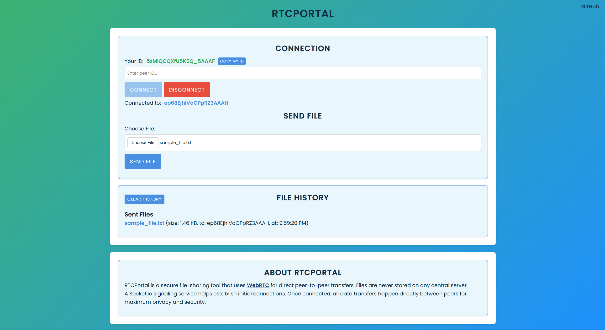

# RTCPortal

**Peer-to-Peer File Transfer with WebRTC**

---

## Overview

RTCPortal is a web-based application that provides a platform for peers to exchange files securely using WebRTC and Socket.IO. It was designed to simplify the file-sharing and communication process by not relying on centralized servers for the transfer process. As of now, RTCPortal does not have a public domain; connections are only established through ports opened by the user.

RTCPortal uses a **signaling server** only during the initial connection phase, which allows peers to find each other. 

Once the connection is established, all file transfers occur **directly between users** via WebRTC. This is why the process is **private and decentralized.**

The easy-to-use UI makes it intuitive for any user to share files securely, as no configurations are necessary.

<p align="center"></p>

---

## Installation


1. **Ensure Node.js is installed**

   RTCPortal requires [Node.js](https://nodejs.org/) to run. You can check if it's installed by running:  

   ```bash
   node -v
   ```
1. **Clone the repository:**
   ```bash
   git clone https://github.com/dpxa/RTCPortal
   ```
3. **Navigate to the project directory**
   ```bash
   cd RTCPortal
   ```
4. **Install Dependencies**
   ```bash
   npm install
   ```
5. **Start the server**
   ```bash
   node server/index.js
   ```
6. **Open your browser**

   - If you have a **custom port configured**, go to:
   
     ```bash
     http://localhost:<your-port>
     ```
   - If you’re using the **default port**, go to:  
     ```bash
     http://localhost:3000
     ```
